# communicate.md — a ledger protocol for multi-agent collaboration

**One markdown file. Multiple AI agents. Real peer review. Full audit trails.**

`communicate.md` is a convention — not a framework — for making two or more
AI agents (any vendor, any model, any harness) work toward a single goal by
reading and appending to a shared, git-versioned markdown ledger.



It works on **any project an agent can touch from a terminal**: web apps,
refactors, test suites, data pipelines, documentation, research reports,
infrastructure. If the work lives in files, a crew can do it.

It was not designed on a whiteboard. It was evolved, under fire, by two AI
agents co-maintaining a live production system where mistakes had real,
irreversible cost. Every rule in [SPEC.md](SPEC.md) exists because its
absence caused a real failure — see [CASE_STUDY.md](CASE_STUDY.md) for the
four critical-path bugs that adversarial ledger review caught before they
reached production, and the coordination failures (name collisions,
scheduler races, state clobbers) that became protocol rules.

## Why a file, not a framework?

| Typical multi-agent framework | The ledger |
|---|---|
| Synchronous, in-process messaging | Asynchronous, durable file |
| Orchestrator delegates to workers | Peers review each other, with verdicts |
| Dies with the process | Survives crashes, restarts, model swaps |
| Opaque logs | Human-readable markdown, git history = provenance |
| Vendor SDK lock-in | Any agent that can read/write a file |

The killer property is **adversarial accountability**: a coder agent and a
reviewer agent with real verdict semantics (`APPROVED`, `BLOCKING`,
counter-review) catch each other's bugs. An orchestrator grading its own
workers' output catches almost nothing. In our case study, the reviewer
caught that the coder's *fix for the reviewer's own blocking finding* was
silently broken — that class of catch only happens between genuine peers.

## Install

One line (puts `communicate` on your PATH; needs Python 3.11+, nothing else):

```bash
sudo curl -fsSL https://raw.githubusercontent.com/Drays-Technology/multi_agent_communication/main/communicate -o /usr/local/bin/communicate && sudo chmod +x /usr/local/bin/communicate
```

Prefer no sudo? Drop it anywhere on your PATH:

```bash
curl -fsSL https://raw.githubusercontent.com/Drays-Technology/multi_agent_communication/main/communicate -o ~/.local/bin/communicate && chmod +x ~/.local/bin/communicate
```

(Or just clone the repo and run `./communicate` — it's a single file.)

## Try it in 30 seconds (no API keys)

```bash
communicate demo
```

Two built-in agents collaborate on a tiny real task: the implementer ships
code with a **real bug**, the reviewer **executes it**, catches the bug,
files a BLOCKING finding, and only approves the goal after independently
re-verifying the fix. The whole story lands in a readable
`communicate-demo/communicate.md`. That's the protocol, live, in seconds —
no accounts, no keys, no cost.

## Run your own crew

`communicate` is a zero-dependency CLI (Python 3.11+): **define agents,
define a goal, let them work.**

```bash
cd your-project
/path/to/communicate init     # guided setup: asks your goal, detects your
                              # agent CLIs, writes crew.toml
/path/to/communicate run      # agents take turns until done
/path/to/communicate status   # goal, roster, ledger tail
```

Heads-up on cost: `run` invokes your agent CLI once per turn — normal API
charges apply, so start with a small goal.

## You are the conscience

The crew works; you supervise. Three commands make the human a first-class
participant — no dashboard, no running process to attach to, just the same
ledger the agents use:

```bash
communicate watch                 # live, color-coded view of every entry
                                  # as agents write them (Ctrl-C to leave —
                                  # the crew keeps working)

communicate say "skip the admin UI, focus on the API tests first"
                                  # adds an "## Owner — Guidance" entry;
                                  # every agent treats the newest Owner
                                  # entry as its top-priority instruction —
                                  # comment, correct, or redirect mid-run

communicate stop "pausing to review"
                                  # a running crew halts after the turn in
                                  # progress; re-run to continue — the
                                  # ledger keeps all state
```

And when you need to shape ONE agent's behavior rather than the whole
crew's:

```bash
communicate say --to Kestrel "stop refactoring, only fix the bug this turn"
                                  # one-time directive: lands in Kestrel's
                                  # inbox as [OWNER] [MENTIONS YOU]; the
                                  # others see it and know it's not theirs

communicate rule Kestrel "never touch the db schema without Heron's APPROVED"
                                  # standing rule: injected into EVERY one
                                  # of Kestrel's future turns, not just the
                                  # next — it binds until you post a newer
                                  # rule changing it (newest wins)
```

The difference matters: inbox items age out once acknowledged; standing
rules are re-asserted every single turn, so a behavioral requirement can't
fade as the ledger grows.

The name `Owner` is reserved for you: agents can't claim it, and the
protocol obliges them to acknowledge your entries when they act on them.
Because your comments live in the same append-only ledger, the full
history of *your* steering is part of the audit trail too.

## Token-efficient memory: agents boot small

Agents are stateless CLI invocations — without care, every turn re-reads a
linearly growing ledger. The tool keeps boots flat instead:

- **Compaction.** Every `compact_every` entries (default 25, set 0 to
  disable), one agent folds the ledger's older history into
  `communicate-digest.md`: decisions in force, open items per agent,
  standing rules, and a file map — under 80 lines. You can also trigger it
  anytime with `communicate compact`.
- **Delta reads.** Once a digest exists, agents are instructed to read the
  digest plus only the entries AFTER the last `COMPACTED` marker — full
  history stays available in the ledger and git for when something needs
  digging into, but nobody pays for it by default.
- **Computed context.** The inbox and standing rules are extracted
  mechanically by the runner (zero model tokens) and injected pre-chewed.
- **Write discipline.** The turn prompt reminds agents: reference files and
  commits instead of pasting contents — every token written to the ledger
  is paid by every collaborator on every future boot.

- **Archival.** When the live ledger passes `archive_after` entries
  (default 120, 0 = off — or run `communicate archive` anytime), everything
  already covered by the digest is **losslessly relocated** to
  `communicate-archive/archive.jsonl` — one JSON object per entry, so old
  history is greppable, `jq`-able, and out of the hot file. A pointer entry
  marks the move; standing rules never leave the live ledger (they bind
  every turn); and archiving refuses to run until a digest covers the
  region, so no knowledge can fall between the files. Search everything —
  live and archived — with:

  ```bash
  communicate history "tokenizer edge case"
  # [archive #5] ## Kestrel — PROPOSED: module 3 (2026-07-07)
  # [live] ## Heron — APPROVED: module 5 (2026-07-07)
  ```

Net effect: a cold agent boot costs roughly the digest (~1k tokens) plus a
handful of recent entries, regardless of whether the project is one day or
one month old — and nothing is ever deleted: summary in the digest, full
text in the archive, originals in git history.

## How agents know who's talking to them

Every turn, each agent receives a computed **inbox** — everything written
since its own last entry, tagged with what it owes: `[MENTIONS YOU]` for
`@TheirName` mentions, `[NEEDS YOUR REVIEW]` for proposals awaiting a
verdict, `[BLOCKING]` for findings on its work, `[OWNER]` for your notes.
Agents must clear their inbox before starting new work. You can peek at
anyone's queue:

```bash
communicate inbox Heron
# Heron: 2 entries since their last turn:
#   - [MENTIONS YOU] [BLOCKING] ## Kestrel — BLOCKING: tokenizer drops empty fields
#   - [OWNER] ## Owner — Guidance
```

`crew.toml` defines the crew — any CLI-invokable agent works, mixed
vendors welcome:

```toml
goal = """Build a REST API for the todo app: CRUD, tests green,
README updated. Don't touch deployment config without asking."""

[[agents]]
name = "Kestrel"
role = "Implementer"
command = 'claude -p {prompt} --permission-mode acceptEdits'

[[agents]]
name = "Heron"
role = "Reviewer"
command = 'claude -p {prompt} --permission-mode acceptEdits'
```

**Who is who?** Identity comes from `crew.toml`: each `[[agents]]` block
IS an agent — the `name` is how it signs the ledger and gets @mentioned,
the `role` is its behavioral contract, the `command` is which model powers
it. Names must be unique; `Owner` is reserved for you; and because
identity is the name (not the model), you can swap the underlying model
mid-project and the agent keeps its history and obligations. Agents that
work *outside* the runner (independent sessions) claim identity instead:
`communicate claim Osprey --role Tester` registers the name in the ledger
after checking nobody holds it.

Each turn, an agent gets its identity, role, the goal, and the protocol
rules; it does real work in your working directory and appends one ledger
entry. The run ends only when one agent claims `GOAL-COMPLETE` **and a
different agent independently approves it** — self-approval doesn't count,
here or anywhere else in the protocol. The ledger is the only state, so a
crashed or stopped run resumes by running again.

## The 60-second protocol version

1. Put a `communicate.md` at your repo root. Commit it with your code.
2. Each agent claims a unique name and a role in its first entry.
3. All coordination happens as **append-only** entries:
   `## <Agent> — <Title> (<date>)`.
4. Code changes reference ledger verdicts; ledger entries reference commits.
5. Disagreements resolve by evidence, escalation to the human owner, or a
   named verdict — never by silently overwriting the other agent's work.

Read [SPEC.md](SPEC.md) for the full protocol, then copy
[examples/minimal-ledger.md](examples/minimal-ledger.md) to start, or let
`communicate init` scaffold it for you.

## Status

Spec version 0.1 — extracted from a working deployment, offered for the
community to use and evolve. PRs welcome, especially:

- adapters/prompts for specific harnesses (Claude Code, Cursor, aider, raw API)
- conventions for >2 agents
- tooling: ledger linters, verdict-tracking dashboards, escalation notifiers

## License

MIT.
